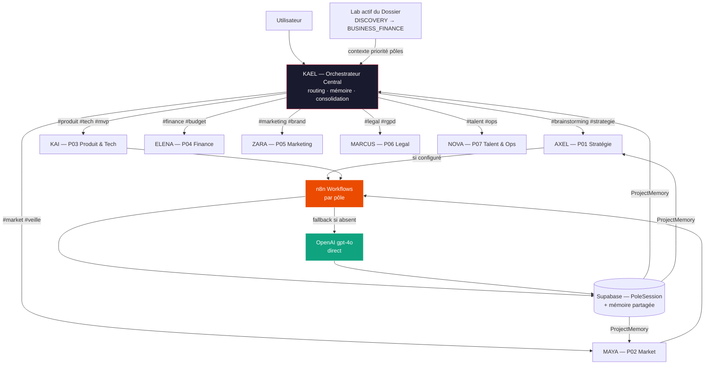

## Prénoms proposés — Les 7 Managers de Pôle

| Pôle | Code | Manager | Identité |
|---|---|---|---|
| Stratégie & Innovation | P01 | **AXEL** | Stratège visionnaire, challenge McKinsey + audace Musk |
| Market & Intelligence | P02 | **MAYA** | Analyste marché acérée, vision Goldman Sachs + VC tier-1 |
| Produit & Tech | P03 | **KAI** | Architecte pragmatique, CTO Silicon Valley + builder solo |
| Finance & Modélisation | P04 | **ELENA** | CFO rigoureuse, scénarios pessimiste/réaliste/optimiste |
| Marketing & Brand | P05 | **ZARA** | CMO créative, brand-obsessed, data-driven growth |
| Legal & Compliance | P06 | **MARCUS** | Conseiller juridique, risk-aware, toujours actionnable |
| Talent & Ops | P07 | **NOVA** | COO opérationnelle, delivery, coordination inter-pôles |

Et **KAEL** reste l'orchestrateur central — upgrade de l'actuel Chef de Projet.

---

## Architecture Globale



---

## Relation Labs ↔ Pôles (coexistence)

Les **Labs** = phase temporelle du projet. Les **Pôles** = domaine thématique expert.
KAEL croise les deux pour prioriser les pôles pertinents.

| Lab actif | Pôles prioritaires (badge "recommandé") |
|---|---|
| DISCOVERY | AXEL · MAYA |
| STRUCTURATION | AXEL · KAI |
| VALIDATION_MARCHE | MAYA · ELENA |
| DESIGN_PRODUIT | KAI · ZARA |
| ARCHITECTURE_TECHNIQUE | KAI · MARCUS |
| BUSINESS_FINANCE | ELENA · NOVA |

---

## Phase 1 — DB Schema (`prisma/schema.prisma`)

### Nouveaux éléments à ajouter

- **Enum `PoleCode`**
  ```
  P01_STRATEGIE, P02_MARKET, P03_PRODUIT_TECH,
  P04_FINANCE, P05_MARKETING, P06_LEGAL, P07_TALENT_OPS
  ```

- **Model `Pole`**
  - `id`, `code PoleCode @unique`, `managerName`, `managerSlug`
  - `systemPrompt String @db.Text`
  - `hashtagTriggers Json` (ex: `["#brainstorming","#strategie","#pitch"]`)
  - `activePriorityLabs Json` (tableau de LabType)
  - `n8nWorkflowId String?` · `n8nWebhookUrl String?`
  - Relation `experts Expert[]` · `sessions PoleSession[]`

- **Update `Expert`**
  - Ajouter `poleId String?` + relation `pole Pole? @relation(...)`
  - Les experts existants deviennent les sous-experts de leur pôle

- **Model `PoleSession`**
  - `id`, `poleId`, `dossierId`, `labAtCreation LabType`
  - `messages Json @default("[]")`
  - `n8nExecutionId String?` · `n8nStatus String?`
  - `status` enum `ACTIVE | COMPLETED | FAILED`
  - `createdAt` · `updatedAt`
  - Index sur `[dossierId]`, `[poleId]`

### Migration Supabase
- `apply_migration` : `ALTER TABLE + CREATE TABLE` pour Pole et PoleSession
- `ALTER TABLE "Expert" ADD COLUMN "poleId"` + FK
- `INSERT INTO "Pole"` pour les 7 pôles (seed inclus dans la migration)
- `UPDATE "Expert" SET "poleId"` pour mapper les experts existants

---

## Phase 2 — Couche n8n (`src/lib/n8n.ts`)

### Connexion MCP (Option A — recommandée)
- Ajouter dans `~/.verdent/mcp.json` :
  ```json
  "n8n": {
    "command": "npx",
    "args": ["n8n-mcp"],
    "env": {
      "N8N_API_URL": "https://[ton-instance-n8n]",
      "N8N_API_KEY": "..."
    }
  }
  ```
- Outils exposés : `executeWorkflow(id, payload)`, `getExecutionStatus(execId)`

### Connexion HTTP Webhook (Option B — fallback)
- `POST [N8N_WEBHOOK_URL]/webhook/[workflowId]` avec header `X-N8N-Secret`
- Polling `GET [N8N_API_URL]/api/v1/executions/[id]` pour le statut

### API Abstraite `src/lib/n8n.ts`
```typescript
invokeN8nPole(poleCode, payload, dossierId) → { executionId, status }
getN8nStatus(executionId) → { status, output }
formatN8nOutput(output) → ChatMessage[]
```
- **Fallback automatique** : si `N8N_API_URL` absent → appel OpenAI direct avec systemPrompt du pôle
- Timeout 30s sur n8n → fallback OpenAI sans erreur visible

---

## Phase 3 — Seeding des 7 Pôles (inclus dans la migration Phase 1)

Pour chaque pôle :
- `managerName` = AXEL / MAYA / KAI / ELENA / ZARA / MARCUS / NOVA
- `systemPrompt` = adapté de `K3RN_POLES_BLUEPRINT.md` (system prompt base de chaque pôle)
- `hashtagTriggers` = tableau JSON des hashtags activateurs du blueprint
- `activePriorityLabs` = tableau selon la matrice Labs ↔ Pôles

---

## Phase 4 — API Routes

| Route | Méthode | Description |
|---|---|---|
| `/api/poles` | GET | Liste des 7 pôles + managers |
| `/api/poles/[poleId]` | GET | Détail + experts du pôle |
| `/api/poles/[poleId]/sessions` | POST | Créer session avec manager (premier message auto) |
| `/api/poles/sessions/[sessionId]/message` | POST | Envoyer message au manager |
| `/api/poles/sessions/[sessionId]/invoke-n8n` | POST | Déclencher workflow n8n du pôle |
| `/api/poles/sessions/[sessionId]/status` | GET | Statut exécution n8n (polling) |
| `/api/kael/route` | POST | KAEL analyse message → retourne pôle ciblé |

Toutes les routes : auth obligatoire, rate limit, audit log.

---

## Phase 5 — Upgrade KAEL (`src/lib/claude.ts`)

- Renommer `invokeChefDeProjet` → `invokeKAEL`
- Signature enrichie :
  ```typescript
  invokeKAEL(dossierId, history, userInput, projectMemory) → KAELResponse
  ```
- `KAELResponse` ajoute :
  ```typescript
  routedPole?: PoleCode      // pôle détecté
  routedManager?: string     // "AXEL", "MAYA"…
  routingReason?: string     // explication du routing
  ```
- Détection hashtags : regex `/#(\w+)/g` sur `userInput` → lookup dans `Pole.hashtagTriggers`
- Si match → routing direct sans question supplémentaire
- KAEL reçoit toujours `projectMemory` en contexte (Phase 6)

---

## Phase 6 — Mémoire Partagée (`src/lib/project-memory.ts`)

```typescript
buildProjectMemory(dossierId: string): Promise<ProjectMemory>
```

Agrège (plafonné à ~6000 tokens) :
- Toutes les **cartes validées** (titre + contenu condensé)
- Les 3 dernières **PoleSession complétées** (dernier message du manager)
- Lab actif + score global courant
- Recommandations KAEL précédentes (3 dernières)

Injecté dans chaque appel LLM : KAEL + tous les managers de pôle.
Chaque manager "sait" ce que les autres pôles ont produit.

---

## Phase 7 — Frontend

### Nouveaux composants

1. **`src/components/poles/pole-hub.tsx`**
   - Grille 7 pôles, chaque card : avatar manager (initiales stylisées colorées), nom, rôle court
   - Badge `recommandé` si le pôle est prioritaire dans le lab actif
   - Click → ouvre `PoleManagerChat`

2. **`src/components/poles/pole-manager-chat.tsx`**
   - Réutilise le layout `ExpertChatPanel` existant
   - Header : avatar + prénom manager + pôle
   - Badge spinner "n8n en cours" pendant exécution workflow
   - Résultat n8n affiché comme message structuré avec icône distincte

3. **`src/components/poles/kael-command-bar.tsx`**
   - Accessible via Cmd+K depuis n'importe quelle page dossier
   - Tape texte libre ou `#hashtag` → KAEL route et affiche le manager ciblé
   - Liste raccourcie des 7 managers avec leur hashtag principal

4. **`src/components/poles/memory-feed.tsx`**
   - Panel "Mémoire Projet" (sidebar collapsable)
   - Affiche : ce que chaque pôle a produit, cartes validées, Lab actif
   - Permet à l'utilisateur de voir l'état global du projet

### Pages modifiées

- **`src/app/dossiers/[id]/onboarding/page.tsx`** : Chef de Projet visuellement renommé → KAEL (avatar K, couleur signature), transition "→ Je te connecte à **AXEL**" animée quand routing détecté
- **`src/app/dossiers/[id]/page.tsx`** : Intégrer PoleHub + `kael-command-bar` dans le layout

---

## Angles Morts & Risques

| Risque | Mitigation |
|---|---|
| n8n workflows n'existent pas encore | Fallback OpenAI direct complet — n8n est une enhancement, pas un prérequis |
| Sorties n8n mal formées → corruption DB | `formatN8nOutput()` avec Zod validation stricte avant écriture |
| Webhook n8n non sécurisé | Header `X-N8N-Secret` vérifié côté Next.js, `N8N_WEBHOOK_SECRET` en `.env` |
| Mémoire partagée trop volumineuse | Plafonné à 6000 tokens — résumés plutôt que contenu brut |
| Collision ExpertPanel existant ↔ PoleHub | Les experts existants DEVIENNENT les sous-experts des pôles — pas de double interface, un seul point d'entrée par pôle |
| KAEL peut mal router | Toujours afficher le pôle détecté + bouton "Changer de pôle" pour correction manuelle |

---

## Traceability — Step → Fichiers → Vérification

| Phase | Fichiers cibles | DoD |
|---|---|---|
| 1 DB | `prisma/schema.prisma` + migration Supabase | `SELECT count(*) FROM "Pole"` = 7 |
| 2 n8n | `src/lib/n8n.ts` + `~/.verdent/mcp.json` | Fallback OpenAI fonctionne si `N8N_API_URL` absent |
| 3 Seed | Migration SQL INSERT | Managers AXEL→NOVA présents avec systemPrompts |
| 4 API | `src/app/api/poles/**` + `src/app/api/kael/route.ts` | GET `/api/poles` retourne 7 pôles |
| 5 KAEL | `src/lib/claude.ts` | `#brainstorming` dans message → `routedPole: P01_STRATEGIE` |
| 6 Mémoire | `src/lib/project-memory.ts` | `buildProjectMemory(id)` non-vide sur dossier avec cartes |
| 7 Frontend | `src/components/poles/**` + pages dossier | PoleHub affiche 7 managers, Cmd+K fonctionne |
